# 🔮 Horóscopo

Aplicación web desarrollada en Java EE (ahora Jakarta EE) que permite consultar predicciones astrológicas diarias, mensuales y anuales para los doce signos del zodiaco.

El proyecto fue desarrollado originalmente con fines académicos y posteriormente fue refactorizado y documentado para formar parte de mi portafolio personal.


## ✨ Funcionalidades

### Usuario visitante

- Consultar la predicción diaria de cualquier signo zodiacal.

### Usuario autenticado

Además de consultar la predicción diaria, un usuario autenticado puede:

- Consultar predicciones mensuales.
- Consultar predicciones anuales.

---

## 🏛 Arquitectura

El proyecto está organizado siguiendo una arquitectura inspirada en el patrón **Modelo-Vista-Controlador (MVC)**, 
separando la lógica de negocio, el acceso a datos y la interfaz de usuario.

Además, incorpora otros patrones y componentes comunes en aplicaciones Java:

- **DAO (Data Access Object)** para el acceso a la base de datos.
- **VO (Value Object)** para transportar la información entre las capas.
- **JSP** para la capa de presentación.
- **Servlets** para la lógica de negocio.
- **JDBC** para la comunicación con MySQL.

---

## 🎯 Objetivo

Desarrollar una aplicación web basada en Java EE que permita consultar predicciones astrológicas para los doce signos del zodiaco, aplicando una arquitectura inspirada en el patrón Modelo-Vista-Controlador (MVC) y realizando operaciones de acceso a datos mediante el patrón DAO.
---

## 🚀 Funcionamiento de la aplicación

### Página principal

- Al entrar a la aplicación web el usuario se encuentra con esta primera vista

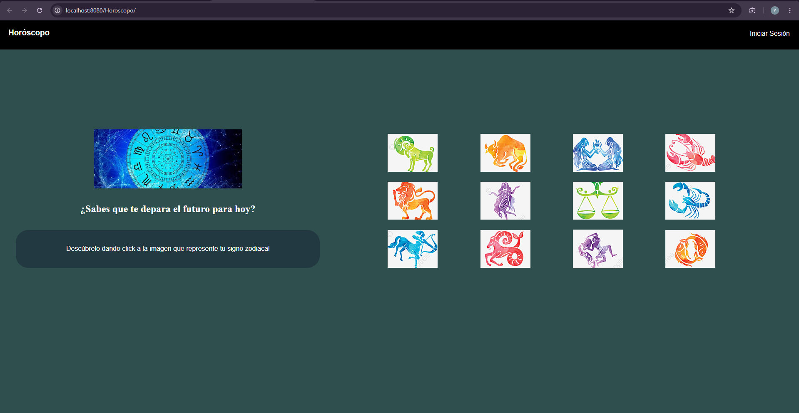

### Consulta diaria

- Cuando el usuario hace clic en la imagen de cualquier signo del zodiaco, muestra la predicción del día

Ejemplo para la predicción diaria del signo aries

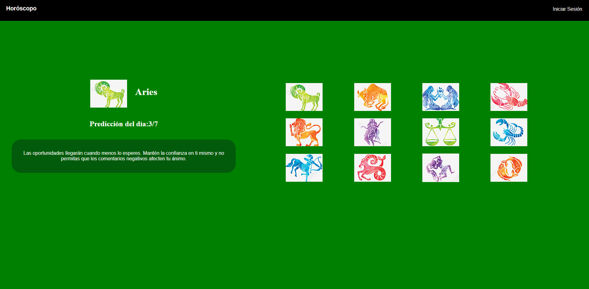

Ejemplo para la predicción diaria del signo piscis

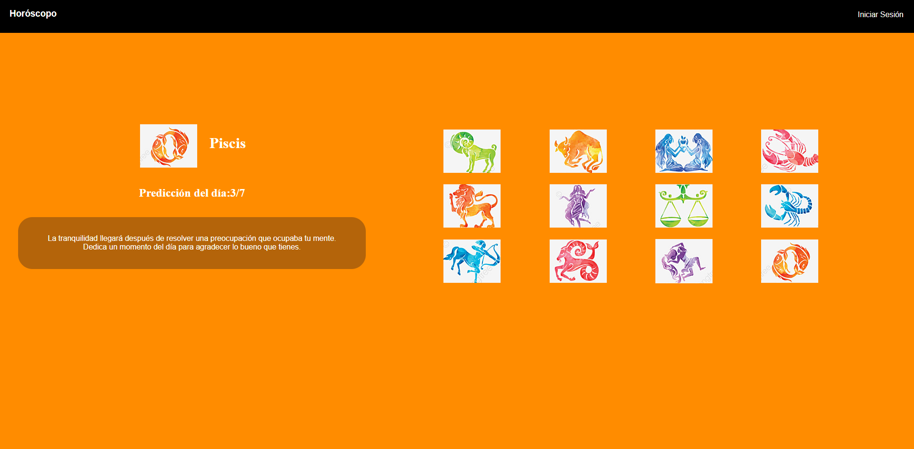

### Inicio de sesión

- El usuario al hacer clic en "iniciar sesión" la aplicación dirige al usuario a la vista de inicio de sesión, donde puede autenticarse

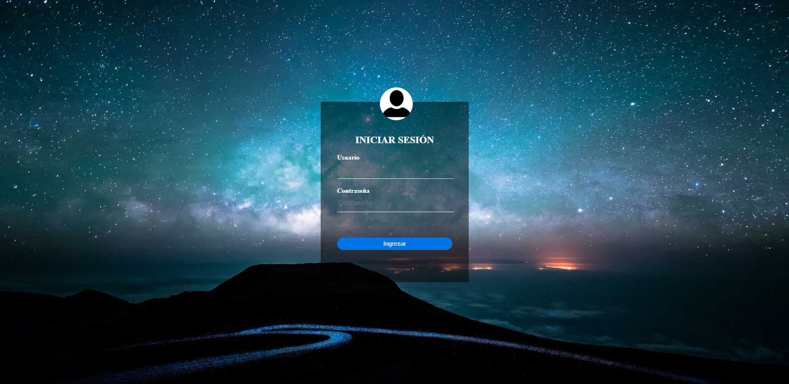

- Al iniciar sesión, el usuario se encuentra con esta vista de la página principal o "home"

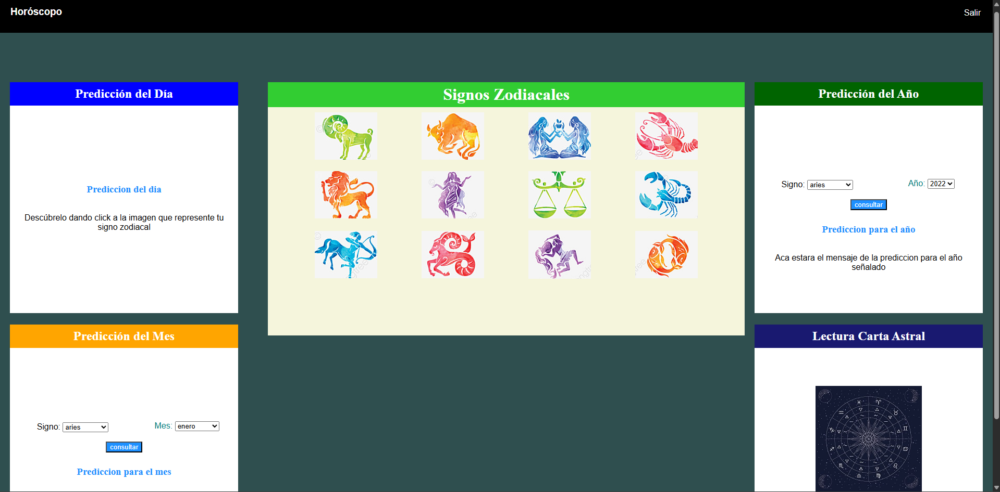

### Predicción del mes y del año

Al hacer clic sobre la imagen del signo zodiacal el usuario puede ver la predicción diaria, la predicción del mes y la predicción del año 
(el mes es enero y el año 2022 por defecto)

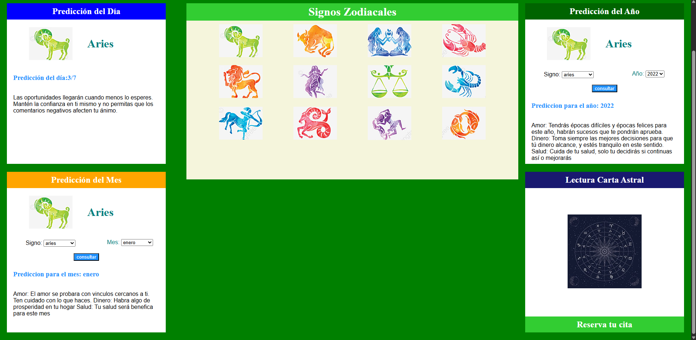

También se puede ver la predicción del mes y del año simplemente seleccionando el signo y el mes o el año correspondiente según el caso

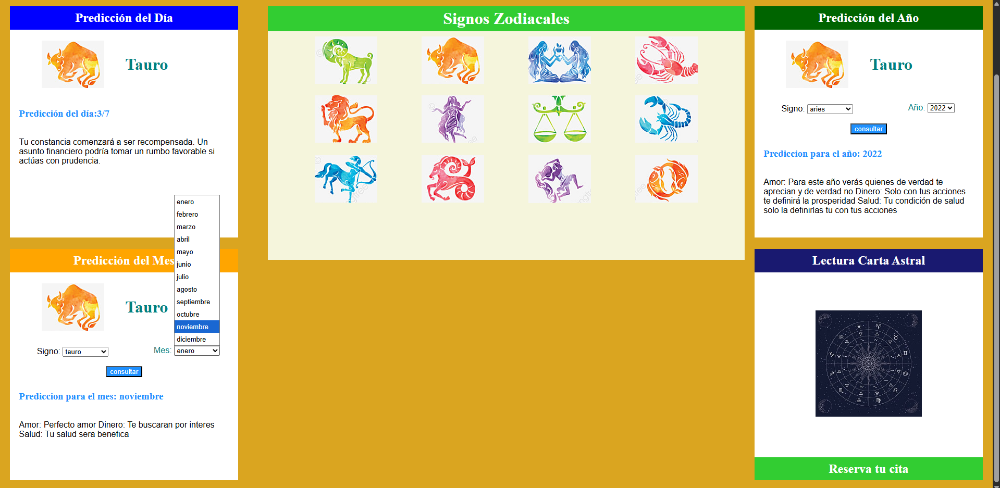

### Reserva de lectura de carta astral

Al hacer clic sobre la imagen de la sección "Lectura Carta Astral" el usuario puede reservar una cita de carta astral, y dirige hacia una vista para hacer la reserva (actualmente esta funcionalidad corresponde únicamente a la interfaz gráfica y se encuentra pendiente de implementación.)

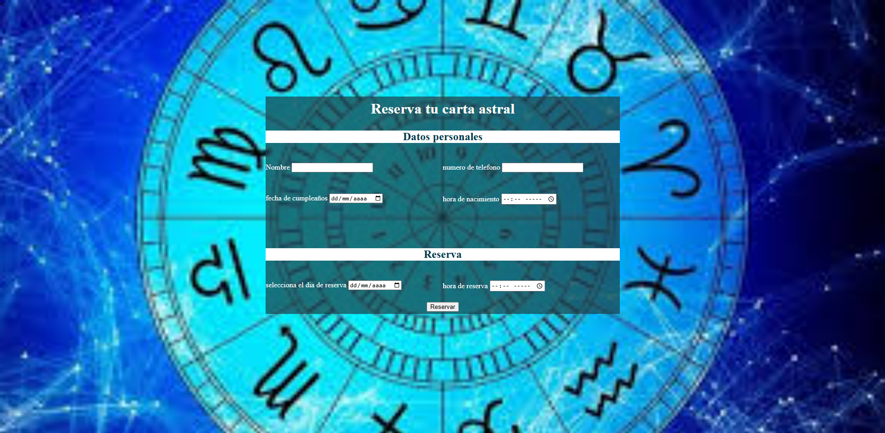


---

## 🛠 Tecnologías utilizadas

- Java
- JSP (JavaServer Pages)
- Java Servlets
- JDBC
- Apache Tomcat
- MySQL
- HTML5
- CSS3
- NetBeans IDE
- Git
- GitHub

---

## 📂 Estructura del proyecto

```text
Horoscopo
├── db/            # Script de la base de datos
├── doc/           # Diagrama de clases
├── lib/           # Librerías externas
├── src/           # Código fuente Java
├── web/           # JSP, CSS e imágenes
```

---

## ⚙️ Instalación

1. Clonar el repositorio.
2. Abrir el proyecto en NetBeans.
3. Crear la base de datos utilizando el script ubicado en `db/horoscopobd.sql`.
4. Configurar la conexión a MySQL en `ConexionBD.java`.
5. Ejecutar el proyecto utilizando Apache Tomcat.

---

<details>
<summary><strong>📖 Guía detallada de instalación y ejecución con XAMPP y NetBeans (haz clic para expandir)</strong></summary>

## Requisitos

- Java JDK 8 o superior (el proyecto fue probado con JDK 21).
- Apache NetBeans.
- XAMPP.
- Apache Tomcat 8.5 o superior.
- MySQL Connector/J.

## 1. Clonar el proyecto

```bash
git clone https://github.com/yf01-web/Horoscopo.git
```

## 2. Instalar e iniciar XAMPP

Descargue e instale XAMPP desde el sitio oficial:

https://www.apachefriends.org/es/download.html

> **Importante:** durante la instalación asegúrese de incluir los componentes **Apache**, **MySQL** y **Tomcat**.

Inicie los servicios de **Apache** y **MySQL** desde el panel de control de XAMPP.

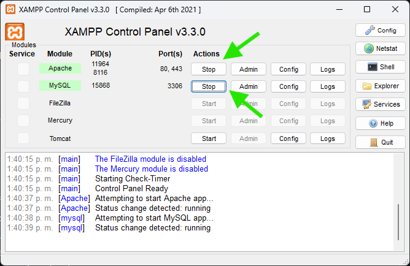

## 3. Crear la base de datos

Abra su navegador y acceda a **phpMyAdmin** desde la siguiente dirección:

```text
http://localhost/phpmyadmin
```

O presione el botón "Admin" del componente de MySQL en el panel de control XAMPP

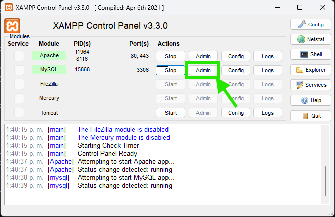

En el panel izquierdo haga clic en **Nueva** y cree una base de datos llamada:

```text
horoscopobd
```

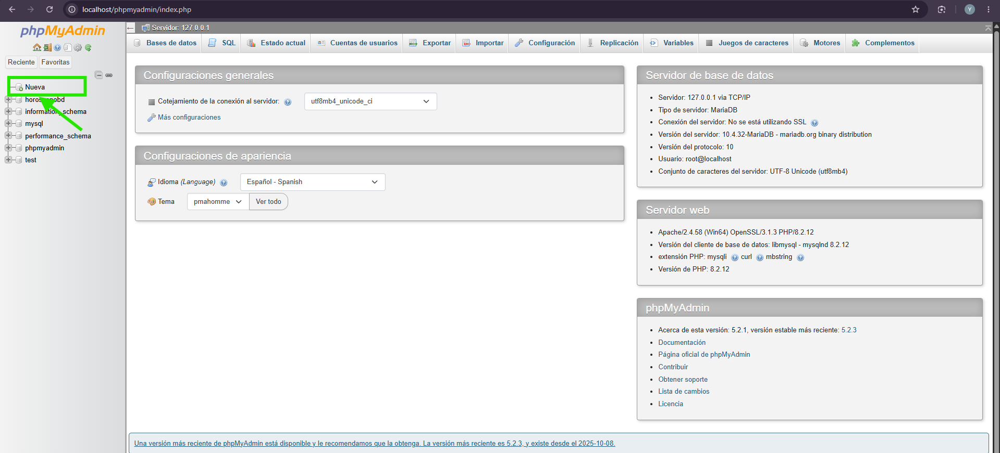

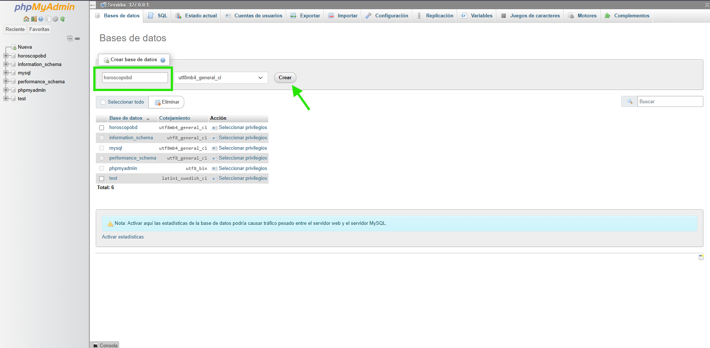

---

## 4. Importar la base de datos

Una vez creada la base de datos:

1. Seleccione **horoscopobd** en el panel izquierdo.
2. Haga clic en la pestaña **Importar**.
3. Presione el botón **Seleccionar archivo**.
4. Busque el archivo:

```text
db/horoscopobd.sql
```
El script de la base de datos se encuentra en db/horoscopobd.sql.

5. Finalmente haga clic en **Importar**.

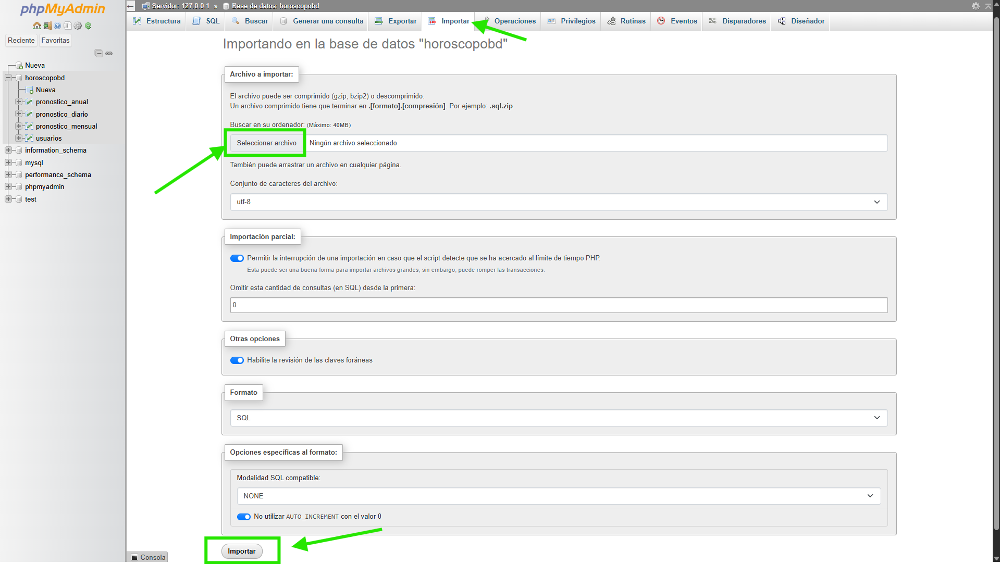

## 5. Abrir el proyecto en NetBeans

Abra Apache NetBeans y seleccione:

```text
File → Open Project...
```
Busque la carpeta donde clonó el repositorio y seleccione el proyecto **Horoscopo**.

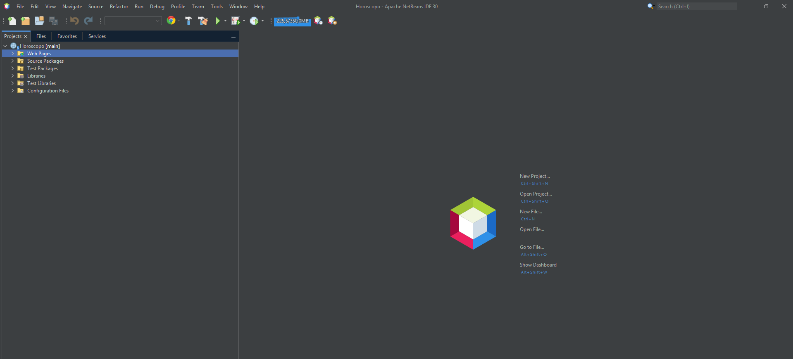

## 6. Configurar Apache Tomcat

Si Apache Tomcat aún no está configurado en NetBeans:

1. Abra la ventana **Services**.
2. Haga clic derecho sobre **Servers**.
3. Seleccione **Add Server...**
4. Elija **Apache Tomcat**.

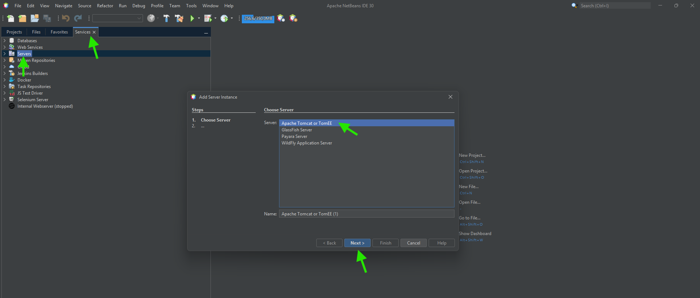

5. Seleccione la carpeta donde se encuentra instalado Tomcat. (Si Tomcat fue instalado mediante XAMPP, solo será necesario indicar la carpeta donde quedó instalado. **Nota:** En la imagen el servidor ya aparece configurado. Si es la primera vez que lo agrega, simplemente continúe con el asistente hasta finalizar la configuración.)

6. Finalice la configuración 

> Durante la configuración podrá definir un usuario y una contraseña para administrar el servidor Tomcat.
>
> Para este proyecto se utilizaron las credenciales de ejemplo:
>
> - **Usuario:** `Admin`
> - **Contraseña:** `Admin`

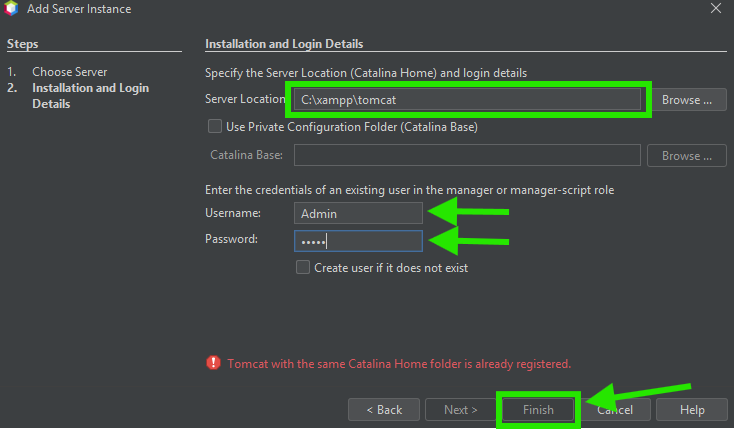

## 7. Configurar el proyecto para utilizar Apache Tomcat

Haga clic derecho sobre el proyecto **Horoscopo** y seleccione:

```text
Properties
```
En la sección **Run**, seleccione Apache Tomcat como servidor.

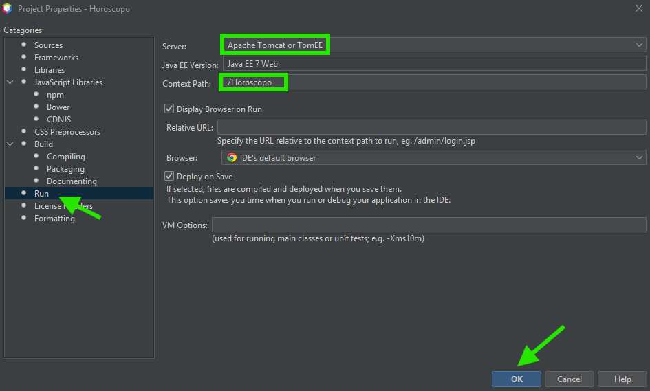

## 8. Verificar la conexión a la base de datos

Abra el archivo:

```text
src/java/Control/Conexion/ConexionBD.java
```

Verifique que la URL, el usuario y la contraseña coincidan con la configuración de MySQL instalada.

URL

```text
jdbc:mysql://localhost:3306/horoscopobd
```

Usuario

```text
root
```

Contraseña

```text
(en blanco por defecto en XAMPP)
```

>**Nota** Si modificó estos datos durante la instalación de MySQL, deberá actualizarlos antes de ejecutar la aplicación.

## 9. Ejecutar el proyecto

Ejecute el proyecto desde NetBeans haciendo clic derecho sobre el proyecto y seleccionando:

```text
Run
```
o presione la tecla F6 (o FN+F6 en algunos teclados).

Si la configuración fue realizada correctamente, el navegador abrirá automáticamente la aplicación.


Podrá acceder desde una dirección similar a (siempre que los servicios de Apache, MySQL y Apache Tomcat se encuentren en ejecución.):

```text
http://localhost:8080/Horoscopo
```

Si todos los pasos anteriores fueron realizados correctamente, la aplicación estará lista para utilizarse.

</details>

## 🗄 Base de datos

El proyecto incluye el script SQL necesario para crear la base de datos:

```text
db/horoscopobd.sql
```

---

## Mejoras realizadas

Como parte de la actualización del proyecto para portafolio se realizaron las siguientes mejoras:

- Reorganización de la interfaz gráfica.
- Documentación del código fuente.
- Organización de la estructura del proyecto.
- Inclusión del script de la base de datos.
- Control de versiones mediante Git y GitHub.

---

## 🔮 Mejoras futuras

- Implementar PreparedStatement para mayor seguridad.
- Mejorar el diseño responsive.
- Incorporar un panel administrativo.
- Permitir el registro de nuevos usuarios.
- Mejorar la validación de formularios.
- Añadir la funcionalidad de la reserva de lectura de carta astral

---

## 📚 Aprendizajes

Durante el desarrollo y la actualización de este proyecto reforcé conocimientos sobre:

- Arquitectura MVC.
- Patrón DAO.
- JDBC.
- Servlets y JSP.
- Programación Orientada a Objetos.
- Git y GitHub.
- Organización y documentación de proyectos.

---

## 👨‍💻 Autor

**Yeison Alexander Farfán**

Proyecto desarrollado con fines académicos en el año 2022 para la asignatura de Programación Avanzada y actualizado como parte de mi portafolio de desarrollo de software.